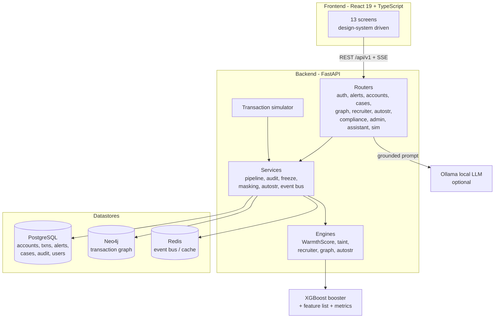
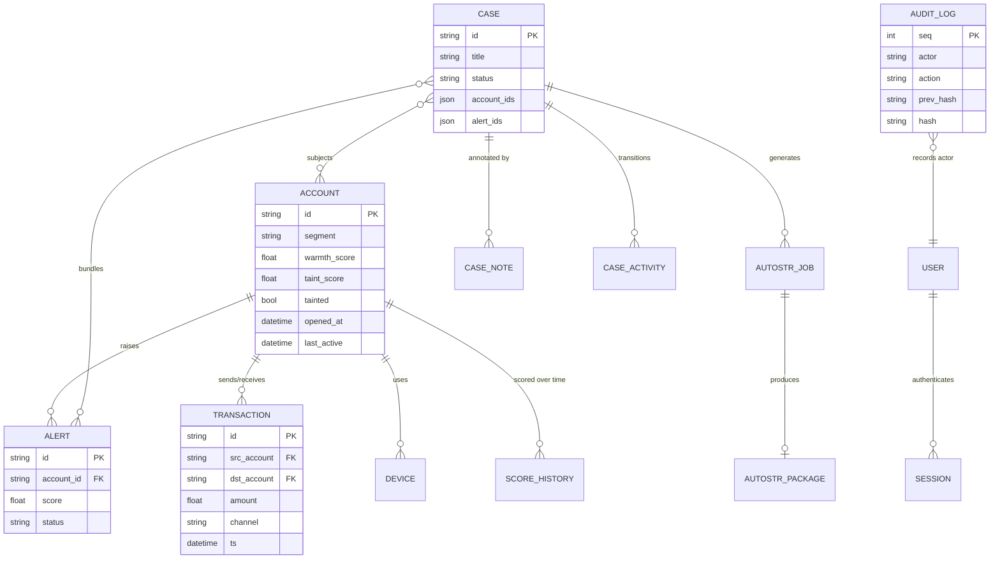
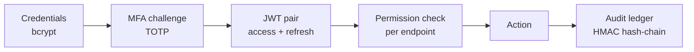

# ARGUS-PRISM

**Mule-account detection and anti-money-laundering intelligence platform for retail banking.**

ARGUS-PRISM ingests a live transaction stream, scores every account for mule risk with an
explainable machine-learning model, surfaces coordinated fraud rings through graph analysis,
and drives the full investigation lifecycle — from alert triage to a signed, regulator-ready
Suspicious Transaction Report — behind role-based access control and a tamper-evident audit
ledger.

- **Backend:** FastAPI (Python 3.11+), ~5,100 LOC
- **Frontend:** React 19 + TypeScript, ~7,200 LOC
- **Datastores:** PostgreSQL, Neo4j, Redis
- **ML:** XGBoost WarmthScore engine with SHAP explanations and a transparent rule-based fallback
- **Status:** 35/35 backend tests passing, clean typecheck and production build, CI on every push

---

## Table of contents

1. [Overview](#overview)
2. [Design principles](#design-principles)
3. [Key capabilities](#key-capabilities)
4. [System architecture](#system-architecture)
5. [Technology stack](#technology-stack)
6. [Repository structure](#repository-structure)
7. [Data model](#data-model)
8. [The detection engines](#the-detection-engines)
9. [Machine-learning model](#machine-learning-model)
10. [Security model](#security-model)
11. [API reference](#api-reference)
12. [Application screens](#application-screens)
13. [Getting started](#getting-started)
14. [Configuration](#configuration)
15. [Testing and CI](#testing-and-ci)
16. [Limitations and honest disclosures](#limitations-and-honest-disclosures)
17. [Roadmap](#roadmap)
18. [Authors](#authors)

---

## Overview

Money mules are accounts recruited to receive and forward the proceeds of fraud, layering
funds so the original crime is hard to trace. Detecting them is difficult because an
individual mule transaction looks ordinary; the signal lives in **behaviour over time** and
in the **network structure** connecting accounts.

ARGUS-PRISM addresses both:

- A **behavioural scorer** (WarmthScore) converts each account's transaction history into a
  0–100 mule-risk score with per-signal explanations, so an analyst always sees *why* an
  account was flagged.
- A **graph layer** (Neo4j) exposes the fan-in / fan-out topology of recruiter rings and
  propagates "taint" outward from a confirmed mule so the ring cannot hide by going dormant.
- A **case and compliance layer** turns findings into auditable investigations and signed
  regulatory filings, with every privileged action written to a hash-chained ledger.

The platform runs entirely on a developer machine via Docker, and degrades gracefully to a
local SQLite database and in-memory event bus when the datastores are unavailable, so the API
always starts.

---

## Design principles

The system is built to three enforced laws:

1. **Contract first.** A feature does not exist until its endpoint is defined in
   `contracts/openapi.yaml`. The frontend generates its typed client from the same contract,
   and CI machine-checks the running API against it. There is no mock-data flag anywhere.
2. **No fabricated data.** Every figure on every screen is computed by the backend from
   transaction data flowing through the real pipeline. Values are never hardcoded in the UI.
3. **No secrets on glass.** No key, token, or integrity material is ever rendered in the UI.
   Integrity is communicated through verifiable status, never raw key material — and a CI
   tripwire fails the build if key patterns appear in the frontend bundle.

---

## Key capabilities

| Capability | Description |
|---|---|
| Live transaction faucet | A seeded, deterministic simulator emits realistic legit and fraudulent transaction campaigns that the pipeline scores in real time. |
| Explainable risk scoring | WarmthScore (0–100) per account, with ranked SHAP contributions and the specific signals that fired. |
| Six behavioural signals | Velocity, round-tripping, structuring below reporting thresholds, dormant-then-active device churn, profile mismatch, and SIM-swap indicators. |
| Graph ring detection | Neighborhood expansion and recruiter fan-out detection over the transaction graph in Neo4j. |
| Taint propagation | Breadth-first taint spread from a confirmed mule, decaying with distance, folded back into connected accounts' scores. |
| Case management | Full lifecycle: open, annotate, attach evidence, escalate, and seal, with a recorded activity trail. |
| AutoSTR generation | One-click generation of a signed, regulator-formatted Suspicious Transaction Report package. |
| Tamper-evident audit | Every privileged action is appended to an HMAC hash-chained ledger with an end-to-end verify endpoint. |
| Role-based access control | Four roles with server-enforced permissions; system administrators are deliberately walled off from customer data. |
| Multi-factor authentication | TOTP enrolment and verification, mandatory for privileged roles. |
| AI examiner | An optional grounded assistant backed by a local Ollama model, with a deterministic fallback that answers from live figures. |

---

## System architecture



The backend is layered strictly: **routers** handle HTTP and authorization, **services**
orchestrate business logic and transactions, and **engines** hold the pure detection
algorithms. Detection engines have no HTTP or database awareness, which keeps them
unit-testable and reusable across the live pipeline and the offline training script.

See [docs/ARCHITECTURE.md](docs/ARCHITECTURE.md) for request-flow and sequence diagrams.

---

## Technology stack

| Layer | Technology |
|---|---|
| API framework | FastAPI, Uvicorn |
| Validation / settings | Pydantic v2, pydantic-settings |
| Relational store | PostgreSQL 16 via SQLAlchemy 2 + psycopg 3 (SQLite fallback) |
| Graph store | Neo4j 5 (community) |
| Cache / event bus | Redis 7 |
| Authentication | JWT (python-jose), bcrypt, TOTP (pyotp) |
| Machine learning | XGBoost, NumPy, scikit-learn (training) |
| Reporting | ReportLab (PDF STR generation) |
| Assistant | Ollama (local LLM, optional) |
| Frontend | React 19, TypeScript, Vite 8, React Router 7 |
| Contract | OpenAPI 3.1 (`contracts/openapi.yaml`), typed into the client |
| Tooling | pytest, ruff, mypy, schemathesis (backend); oxlint, tsc (frontend) |
| Orchestration | Docker Compose |

---

## Repository structure

```
ARGUS-PRISM/
├── backend/                     FastAPI application
│   └── app/
│       ├── routers/             HTTP endpoints, one module per domain
│       ├── services/            business logic (pipeline, audit, freeze, masking, autostr)
│       ├── engines/             pure detection algorithms
│       │   ├── warmthscore/     XGBoost + rule-based scorer, features, signals
│       │   ├── taint/           BFS taint propagation
│       │   ├── recruiter/       fan-out ring detection
│       │   ├── graph/           neighborhood expansion
│       │   └── autostr/         STR document generators
│       ├── models/              SQLAlchemy ORM models
│       ├── auth/                JWT, MFA, RBAC
│       ├── simulator/           seeded transaction faucet + scenario campaigns
│       ├── core/                config, domain constants, response envelopes
│       └── db/                  engine, session, fallback logic
│   ├── tests/                   pytest suite (9 modules, 35 tests)
│   ├── seed_demo.py             seeds cases + audit chain
│   └── seed_sim.py              seeds accounts/alerts via the simulator (idempotent)
├── frontend/                    React + TypeScript SPA
│   └── src/
│       ├── screens/             13 route-level screens
│       ├── shell/               app shell, auth context, layout
│       ├── canon/ primitives/   design-system components
│       ├── engine/ lexicon/     domain UI logic and copy
│       ├── styles/              design tokens (palette, type, spacing, motion)
│       └── api/                 typed API client (generated from OpenAPI)
├── ml-models/                   offline WarmthScore training
│   ├── warmth/train.py          XGBoost training entrypoint
│   ├── warmth/dataset.py        synthetic labelled dataset builder
│   └── artifacts/               trained booster, feature list, metrics
├── contracts/openapi.yaml       API contract (single source of truth)
├── docs/                        architecture and UI blueprint
├── infra/docker-compose.yml     full local stack
├── .github/workflows/ci.yml     CI: lint, type, test, contract, secret tripwire
└── start-stack.ps1              one-command launcher (Windows)
```

---

## Data model



---

## The detection engines

### WarmthScore (behavioural)
Extracts a fixed feature vector from an account's transactions, devices, and profile, then maps
it to a 0–100 mule-risk score. The primary path is a trained XGBoost booster with SHAP
attributions; if the artifact or library is unavailable, a transparent weighted six-signal
scorer produces the same shape of result. Either way the score is explainable.

The six signals:

| Code | Signal | Intuition |
|---|---|---|
| S1 | Velocity | Rapid inflow immediately forwarded out |
| S2 | Round-trip | Funds cycling between a small account set |
| S3 | Structuring | Amounts kept just under reporting thresholds |
| S4 | Dormant device | Long-idle account reactivating with new device churn |
| S5 | Profile mismatch | Throughput inconsistent with the account's stated segment |
| S6 | SIM-swap | Recent SIM-swap indicators around high-value movement |

### Taint propagation (network)
When a mule is confirmed and frozen, a breadth-first search spreads taint outward through the
transaction graph up to a configurable hop limit. Taint decays per hop and acts as a high-water
mark — never lowering an existing stronger taint — and is folded back into each connected
account's WarmthScore, pulling genuinely connected accounts up while leaving distant strangers
untouched.

### Recruiter detection (ring)
Identifies recruiter accounts by their fan-out signature — one account seeding many downstream
mules, often preceded by tiny test payments — and exposes the whole campaign for a single
freeze action.

---

## Machine-learning model

The WarmthScore model is a real, trained **XGBoost** classifier producing calibrated mule
probabilities with SHAP explanations. It is trained by
[`ml-models/warmth/train.py`](ml-models/warmth/train.py) and loaded at inference by the backend.

**Design principle — no train/serve skew:** training reuses the *exact* feature extractor the
backend uses in production (`app.engines.warmthscore.features`), so the model can never be fed a
different feature space than the one it serves.

Reported metrics on the held-out split:

| Metric | Value |
|---|---|
| AUC-ROC | 0.981 |
| Precision | 0.987 |
| Recall | 0.970 |
| F1 | 0.979 |
| Decision threshold | 0.325 |

> **Important disclosure.** These metrics are computed on a **synthetic** dataset generated to
> match the simulator's distribution; the training and test splits come from the same generator.
> They demonstrate that the model correctly learns the encoded behavioural patterns, but they are
> **not** evidence of real-world detection performance. See
> [Limitations and honest disclosures](#limitations-and-honest-disclosures).

Retrain with:

```bash
cd ml-models
pip install -r requirements.txt
python -m warmth.train --n 16000 --seed 42 --rounds 400
```

---

## Security model



- **Authentication:** password (bcrypt) then TOTP. MFA is mandatory for MLRO and SYS_ADMIN.
- **Sessions:** short-lived access tokens with rotating refresh tokens; refresh reuse is detected
  and revoked.
- **Authorization:** every protected endpoint enforces a permission server-side. The UI never
  decides access.
- **Audit:** privileged actions append to an HMAC hash-chained ledger; `GET /api/v1/audit/verify`
  recomputes the chain end-to-end and reports the first break if any.
- **PII:** tokenized/masked; analysts see masked data, and system administrators cannot see
  customer data at all.

### Role and permission matrix

| Permission | MLRO | Analyst | Auditor | Sys Admin |
|---|:---:|:---:|:---:|:---:|
| View alerts / accounts / graph | yes | yes | - | - |
| View / annotate / escalate cases | yes | yes | read-only | - |
| Run AI assistant | yes | yes | - | - |
| Freeze account | yes | - | - | - |
| Approve STR | yes | - | - | - |
| View PII | yes | masked | - | - |
| Close case | yes | - | - | - |
| View audit / reports | yes | - | yes | - |
| Manage users | - | - | - | yes |
| System health / simulator | - | - | - | yes |

---

## API reference

All endpoints are under `/api/v1`. Selected routes:

| Method | Path | Purpose |
|---|---|---|
| POST | `/auth/login` | Credentials, returns an MFA challenge token |
| POST | `/auth/mfa/enroll` | Issue a TOTP provisioning URI |
| POST | `/auth/mfa/verify` | Verify TOTP, return JWT pair |
| POST | `/auth/refresh` | Rotate the refresh token |
| GET | `/auth/me` | Current user and role |
| GET | `/alerts` | List alerts |
| PATCH | `/alerts/{id}` | Acknowledge / update an alert |
| POST | `/alerts/{id}/escalate` | Escalate to a case |
| GET | `/accounts/{id}` | Account detail |
| GET | `/accounts/{id}/signals` | Signals and SHAP contributions |
| POST | `/accounts/{id}/actions` | Freeze and other privileged actions |
| GET | `/cases` | List cases |
| POST | `/cases/{id}/notes` | Annotate a case |
| GET | `/graph/neighborhood/{id}` | Account neighborhood subgraph |
| POST | `/graph/freeze-cluster` | Freeze a detected cluster |
| GET | `/recruiters` | Detected recruiter accounts |
| POST | `/recruiters/{id}/freeze-campaign` | Freeze a whole campaign |
| POST | `/autostr/{caseId}/generate` | Generate a signed STR package |
| GET | `/audit/verify` | Verify the audit hash-chain |
| POST | `/assistant/chat` | Grounded assistant (SSE stream) |
| POST | `/sim/scenario` | Drive the transaction simulator |

The full contract lives in [`contracts/openapi.yaml`](contracts/openapi.yaml) and is browsable at
`/docs` when the backend is running.

---

## Application screens

The frontend follows a documented design system (see
[docs/UI-MASTER-BLUEPRINT.md](docs/UI-MASTER-BLUEPRINT.md)).

| Route | Screen | Role |
|---|---|---|
| `/` | Landing | Public entry |
| `/login` | Login | Credentials plus MFA |
| `/alerts` | Examination Desk | Alert triage queue |
| `/command-center` | Press Floor | Live operations overview |
| `/accounts` | Specimen Book | Account explorer and score detail |
| `/graph` | Plate | Transaction graph visualization |
| `/recruiters` | Recruiter Die | Ring / campaign view |
| `/cases` | Docket | Case management |
| `/autostr/:caseId` | Printing Room | STR generation and signing |
| `/compliance` | Bound Register | Audit ledger and reports |
| `/admin` | Mint | User and simulator administration |

---

## Getting started

### Prerequisites
- Docker Desktop
- Python 3.11+ and Node.js 18+ (for running the app outside containers)

### Quick start (Windows, one command)

```powershell
./start-stack.ps1 -Seed        # datastores + backend + AI model + demo data
cd frontend; npm run dev        # frontend at http://localhost:5173
```

### Manual start

```bash
# 1. Datastores
docker compose -f infra/docker-compose.yml up -d postgres neo4j redis

# 2. Backend
cd backend
python -m venv .venv && . .venv/Scripts/activate      # Windows
pip install -e ".[dev]"
uvicorn app.main:app --host 127.0.0.1 --port 8000

# 3. Seed demo data (optional)
python seed_demo.py            # cases + audit chain
python seed_sim.py             # accounts / transactions / alerts

# 4. Frontend
cd ../frontend
npm install
npm run dev
```

Health check: `http://localhost:8000/health`. Interactive API docs: `http://localhost:8000/docs`.

### Optional — the AI examiner

```bash
docker compose -f infra/docker-compose.yml --profile assistant up -d ollama
docker exec $(docker ps -qf name=ollama) ollama pull gemma:2b
# set ASSISTANT_ENABLED=true in .env
```

### Demo accounts
Seeded operator accounts share the development password `Prism@2026`:

| Email | Role |
|---|---|
| `mlro@unionbank.co.in` | MLRO |
| `analyst@unionbank.co.in` | Fraud Analyst |
| `auditor@unionbank.co.in` | Compliance Auditor |
| `admin@unionbank.co.in` | System Administrator |

---

## Configuration

Configuration is environment-driven; see [`.env.example`](.env.example) for the full list. The
backend's defaults point at the ports the Docker stack publishes, so no changes are needed for
local development. Key groups: datastore URLs, JWT and MFA parameters, signing/integrity keys,
WarmthScore thresholds, simulator seed, and assistant (Ollama) settings.

The backend degrades to a local SQLite database and in-memory event bus when Postgres, Neo4j, or
Redis are unreachable, so the API always starts.

---

## Testing and CI

```bash
cd backend
pip install -e ".[dev]"
pytest -q                       # 35 tests
ruff check .                    # lint
mypy app                        # type-check (advisory)

cd ../frontend
npx tsc -b --noEmit             # typecheck
npm run build                   # production build
```

Continuous integration ([`.github/workflows/ci.yml`](.github/workflows/ci.yml)) runs on every push
to `main` and every pull request, with three jobs:

- **backend** — ruff lint, mypy type-check, and the full pytest suite.
- **contract** — validates `openapi.yaml` is OpenAPI 3.1 and runs schemathesis against the live
  API to check the implementation matches the contract.
- **secret-grep** — a tripwire that fails the build if key material (private keys, `otpauth://`,
  signing/HMAC keys) is found anywhere in the frontend source or bundle.

Current status: backend 35/35 passing, frontend typecheck and build clean.

---

## Limitations and honest disclosures

This project is built to a high engineering standard, and it is worth being precise about what it
does and does not demonstrate:

- **Data is synthetic.** All accounts, transactions, and labels come from a domain simulator. No
  real banking data is used (real AML data is privacy-restricted and unavailable). The ML metrics
  above are measured on data from the same generator as the training set, so they show the model
  correctly learns the encoded patterns, not real-world detection accuracy. Validating on an
  independent public dataset (for example PaySim or the Elliptic Bitcoin graph) is the
  highest-value next step and would make the metrics non-circular.
- **Single-machine, development-grade.** The stack runs locally with development secrets. It is not
  hardened or deployed for production, and has not been load-tested at scale.
- **Desktop-first UI.** The console targets viewports at or above 1280px.
- **Advisory CI checks.** mypy and schemathesis run in an advisory (non-blocking) mode; making them
  blocking is planned.

---

## Roadmap

- External validation of the WarmthScore model against a public fraud dataset, with a published
  confusion matrix and precision/recall/AUC.
- Promote mypy and schemathesis from advisory to blocking in CI, and add frontend tests.
- Responsive layout support below 1280px.
- Alembic-managed schema migrations wired into startup.
- Deployment to a public environment with managed secrets.

---


---

## License

Academic / educational project. Not licensed for production financial use.
