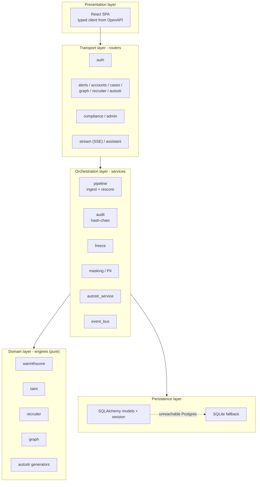
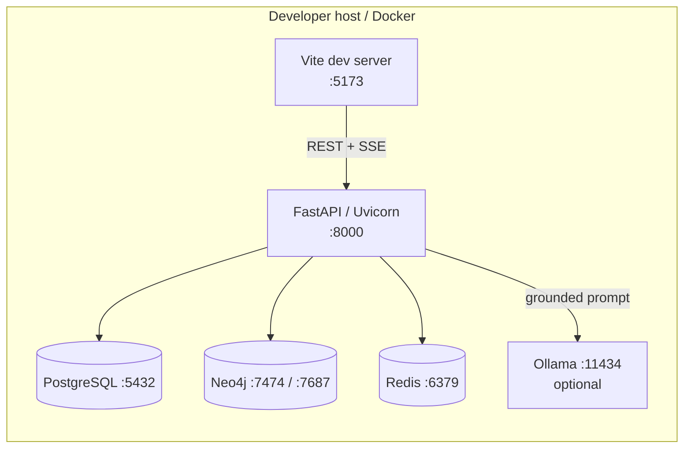
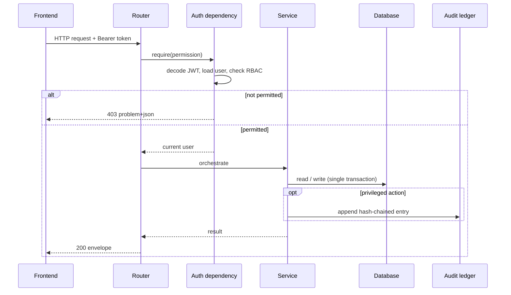
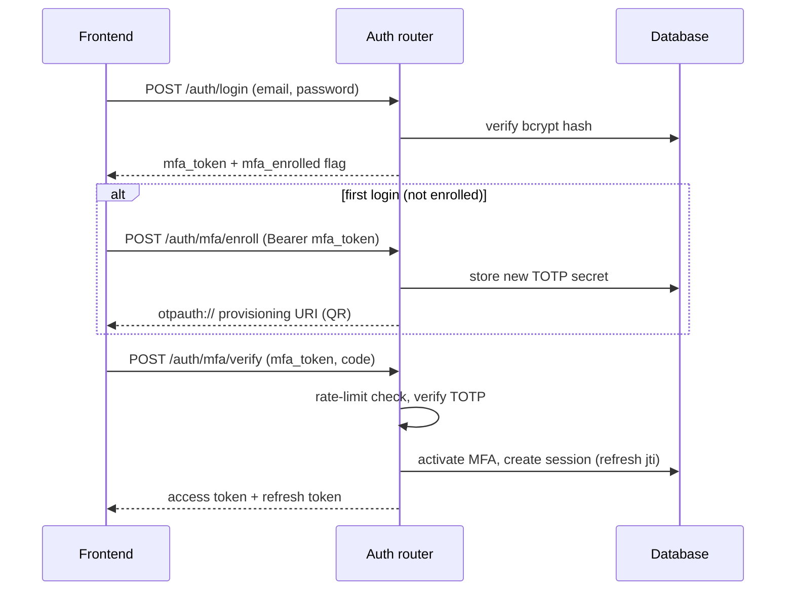
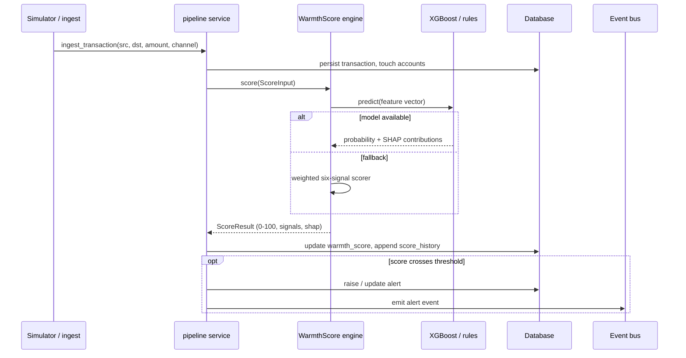
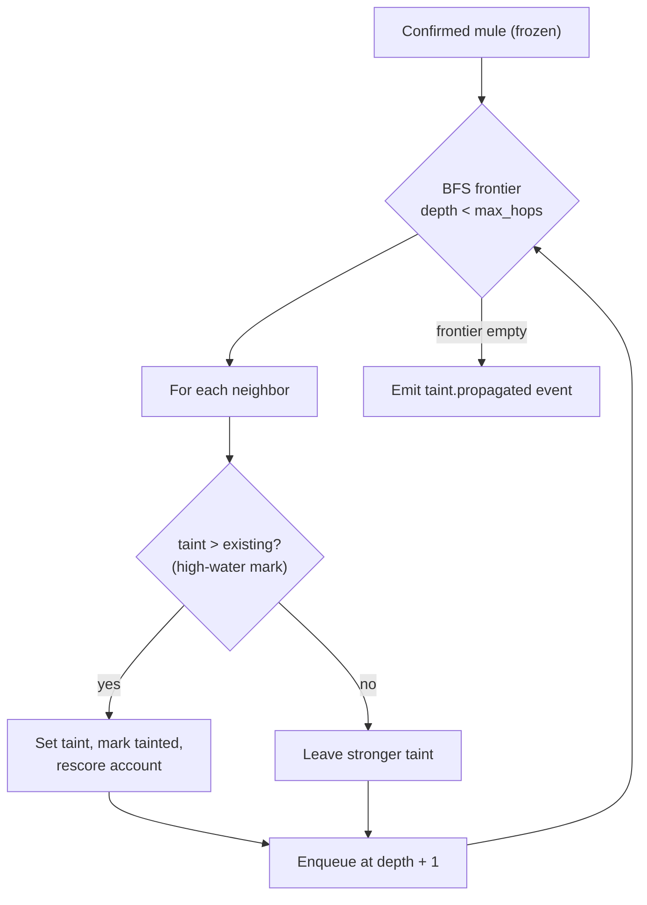
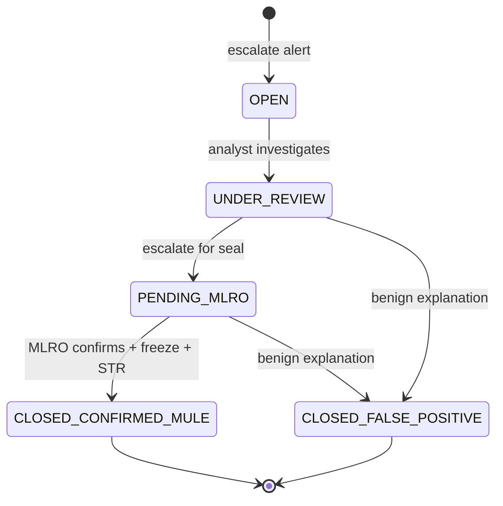
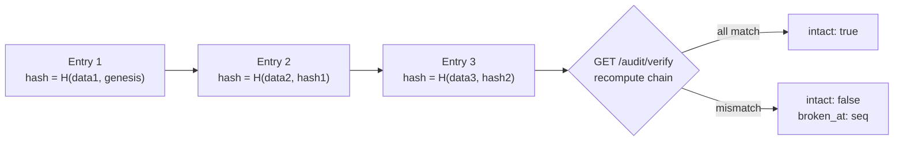
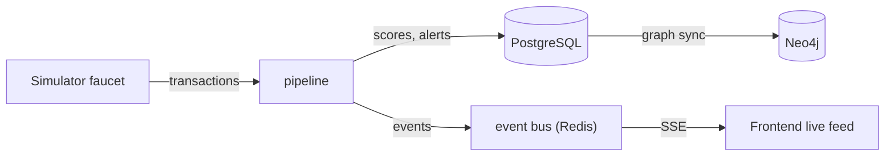
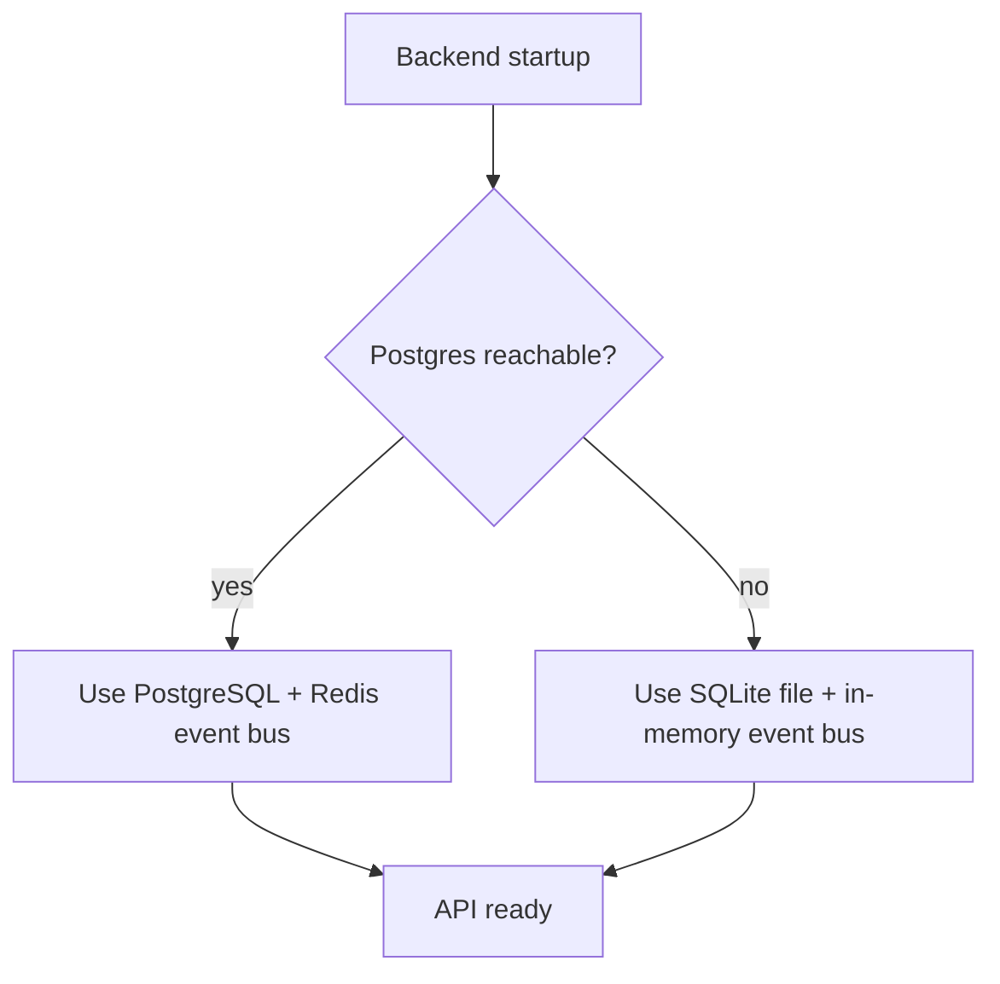

# ARGUS-PRISM — Architecture

This document describes the internal architecture of ARGUS-PRISM: how requests flow, how an
account is scored, how fraud rings are propagated, and how the security and audit guarantees are
implemented. For a product overview, setup, and API summary, see the [README](../README.md).

---

## 1. Architectural overview

ARGUS-PRISM is a layered monolith with clean internal boundaries. The backend separates transport,
orchestration, and algorithms so that the detection logic is pure and independently testable.

**Boundary rule.** Engines import no FastAPI and no database session. They accept plain inputs
(`ScoreInput`, account/transaction data) and return plain results. This is what lets the offline
training script reuse the production feature extractor with zero train/serve skew.

---

## 2. Deployment topology

The frontend runs as a separate dev server; the backend and datastores run under Docker Compose.
The `assistant` compose profile adds Ollama. Health for all dependencies is reported by
`GET /health`.

---

## 3. Request lifecycle

Every protected request passes through authentication, permission enforcement, orchestration, and
(for privileged actions) the audit ledger.

Responses use a consistent envelope, and errors use `application/problem+json`.

---

## 4. Authentication and MFA

- MFA is mandatory for MLRO and SYS_ADMIN and nagged-but-optional for other roles.
- Verification is rate-limited per user to resist brute force.
- Refresh tokens rotate on use; a reused refresh token is treated as compromise and revoked.

---

## 5. Scoring pipeline

The pipeline is the heart of the system: it ingests a transaction, updates the account, and
rescores it, raising or updating an alert when the score crosses a threshold.

WarmthScore bands (watch, warming, hot, critical, imminent) are configurable thresholds. The
score history table records the trajectory over time, which drives the account's sparkline and the
"dormant-then-hot" narrative.

---

## 6. Taint propagation

When an account is confirmed a mule and frozen, taint is propagated through the transaction graph
so connected accounts are re-evaluated.

Taint decays geometrically per hop and is folded into the neighbor's WarmthScore as a network
contribution. Because it is a high-water mark, revisiting an account never weakens an existing
stronger taint, and breadth-first order guarantees each account is first reached by its shortest
(strongest) path. The hop limit bounds blast radius so distant strangers are untouched.

---

## 7. Case lifecycle and AutoSTR

Confirming a mule triggers AutoSTR: the service composes a Suspicious Transaction Report from case
evidence, renders it to PDF (ReportLab), and signs the package. Generation is asynchronous — the
client polls a job until the package is ready to download or approve. Every transition and every
privileged step is written to the audit ledger.

---

## 8. Tamper-evident audit ledger

Each audit entry stores the hash of the previous entry, forming a chain. Any modification or
deletion breaks every subsequent hash, and the verify endpoint recomputes the chain end-to-end.

Hashing is keyed with an HMAC secret held only on the server (never sent to the UI). The signing
and audit keys are configuration, and rotating them requires re-sealing the chain — documented in
the operational notes.

---

## 9. Data flow and events

The simulator is deterministic (seeded), so a scenario replays identically — valuable for demos
and for reproducing a scored state. Events flow through Redis (or an in-memory bus in the fallback
mode) and are streamed to the frontend over Server-Sent Events for the live floor view.

---

## 10. Graceful degradation

The API is designed never to fail to start. If the datastores are down it falls back to a local
SQLite database and an in-memory event bus, so development and demos can proceed. Health reporting
distinguishes the active backend so the degraded mode is visible, never silent.

---

## 11. Testing strategy

- **Unit-friendly engines.** Pure functions with deterministic inputs make the detection logic
  straightforward to test.
- **API tests.** The pytest suite exercises auth (full login + MFA + refresh rotation), alerts,
  accounts, cases, compliance, graph/recruiter, AutoSTR, the pipeline, and the assistant's grounded
  fallback path, against a throwaway SQLite database per session.
- **Contract tests.** CI runs schemathesis against the live API to check conformance with
  `openapi.yaml`.
- **Security tripwire.** CI greps the frontend for key material to enforce the no-secrets-on-glass
  law.

See the [README testing section](../README.md#testing-and-ci) for commands.
